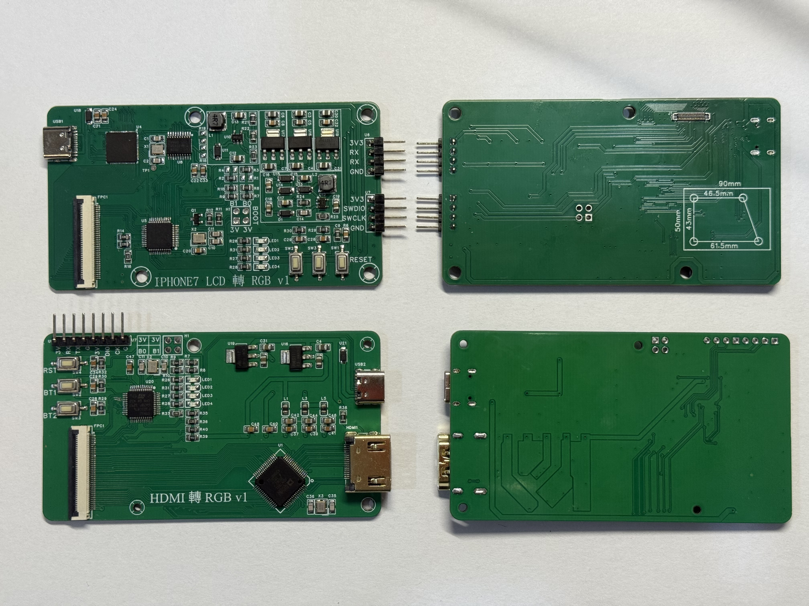
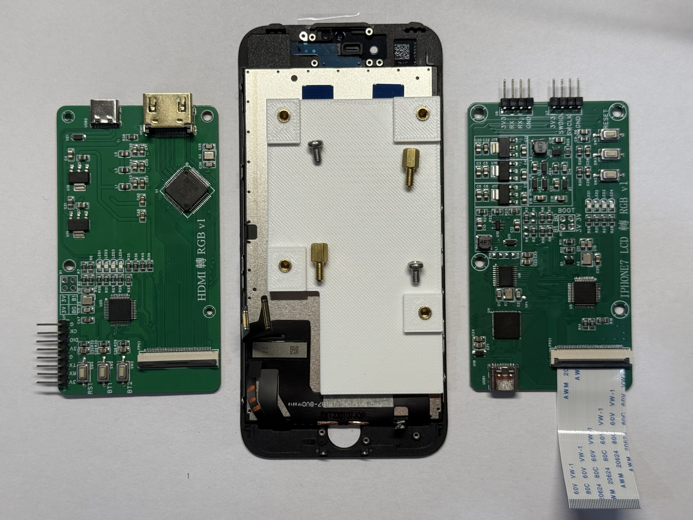
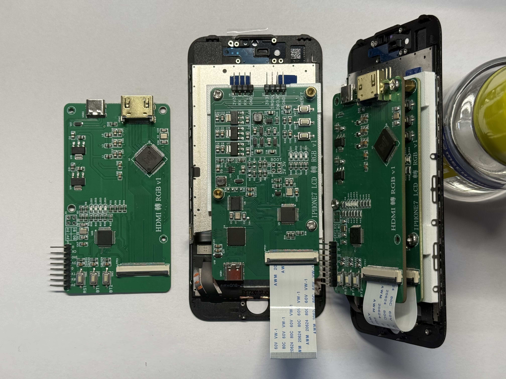
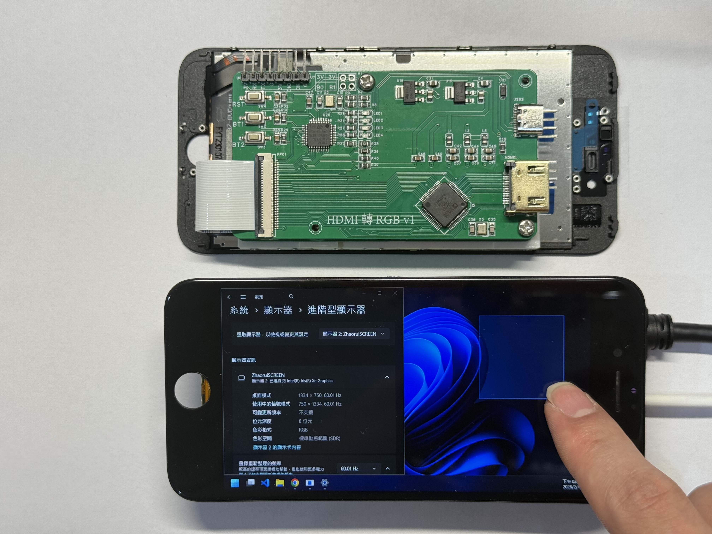
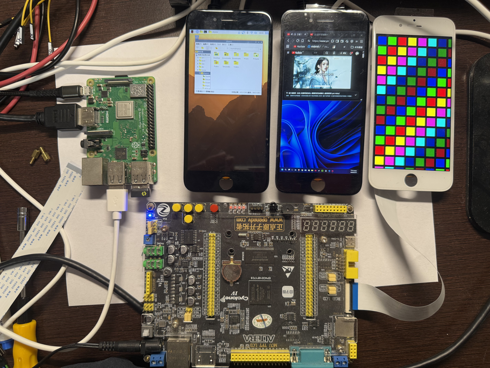
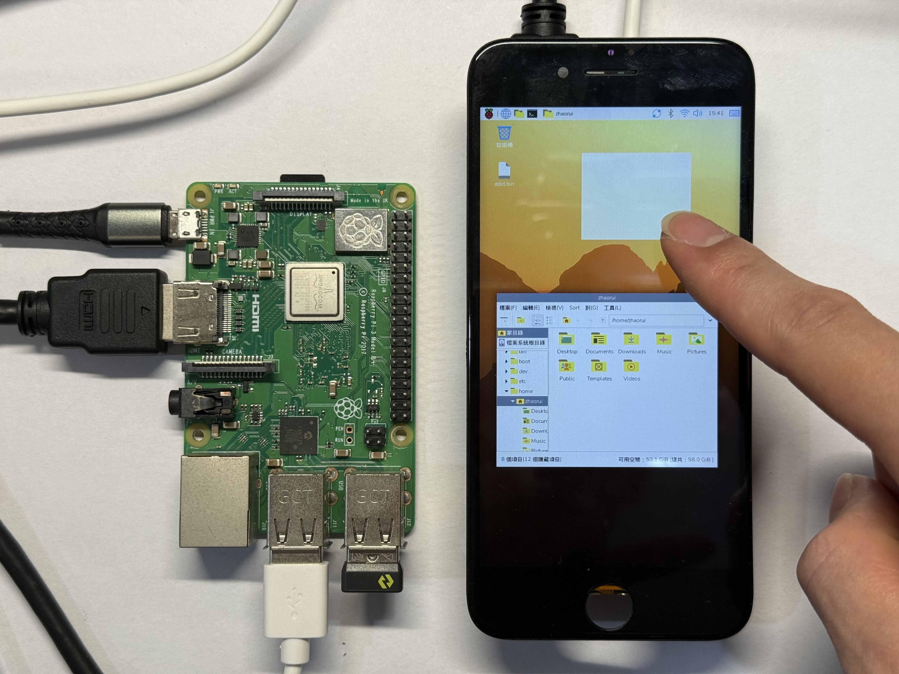

# iPhone Screen Bridge

將 iPhone 7 螢幕轉換為通用顯示器的硬體驅動方案。

## 專案簡介

將 iPhone 7 MIPI DSI 螢幕轉成標準 RGB 輸入，支援 HDMI 或 FPGA 驅動。

## 專案結構

### `boards/iphone7/`
- **`fw/ip7_lcd_to_rgb/`** - STM32 韌體：RGB → MIPI (SSD2828)
- **`fw/hdmi_to_rgb/`** - STM32 韌體：HDMI → RGB (ADV7611)
- **`fw/edid/`** - HDMI EDID
- **`pcb/`** - PCB 與 BOM

### `platforms/altera_fpga/`
- **`rgb_fpga/`** - FPGA 測試圖案 RGB 輸出

## 硬體架構

本專案使用 **兩塊 PCB** 協同工作：

### PCB1 - RGB to MIPI 轉接板 (`ip7_lcd_to_rgb`)

**功能：** RGB → iPhone 7 MIPI DSI

**核心晶片：**
- STM32F103 微控制器
- SSD2828 MIPI DSI 橋接晶片

**接口：**
- 輸入：24-bit RGB + HSYNC + VSYNC + DEN + PCLK
- 輸出：MIPI DSI 4-lane 至 iPhone 7 螢幕 FPC 連接器
- 電源：提供 LCD 背光與觸控所需電源
- **觸控功能：** 讀取 iPhone 7 觸控 IC 數據，透過 SPI 轉發至 PCB2

**觸控數據流：**
```
iPhone 7 觸控 IC → SPI (STM32 讀取) → SPI2 (轉發) → PCB2
```

**韌體：** [ip7_lcd_to_rgb](boards/iphone7/fw/ip7_lcd_to_rgb/)

**互動式 BOM：** [PCB1 BOM](boards/iphone7/pcb/ip7_lcd_to_rgb/InteractiveBOM_PCB1_2025-9-3.html)

**原理圖：** [PCB1 SCH](boards/iphone7/pcb/ip7_lcd_to_rgb/SCH_iphone7_mipi_rgb_2025-09-04.pdf)

---

### PCB2 - HDMI to RGB 轉接板 (`hdmi_rgb_adv7611`)

**功能：** HDMI → RGB（可選）

**核心晶片：**
- **USB HID：** 將觸控數據轉換為 USB HID 多點觸控設備（最多 5 點）
- **SPI2：** 接收來自 PCB1 的觸控數據

**觸控數據流：**
```
PCB1 (SPI2 Master) → INT 中斷通知 → PCB2 (SPI2 Slave) → USB HID → 電腦
```
- ADV7611 HDMI 接收晶片

**接口：**
- 輸入：HDMI (支援 EDID 設定)
- 輸出：24-bit RGB + HSYNC + VSYNC + DEN + PCLK
- USB：可選 USB HID 多點觸控輸出功能

**韌體：** [hdmi_to_rgb](boards/iphone7/fw/hdmi_to_rgb/)

**互動式 BOM：** [PCB2 BOM](boards/iphone7/pcb/hdmi_rgb_adv7611/InteractiveBOM_PCB2_2026-1-5.html)

**原理圖：** [PCB2 SCH](boards/iphone7/pcb/hdmi_rgb_adv7611/SCH_hdmi_rgb_adv7611_2026-01-05.pdf)

**PCB2 已知問題：**
- BL 接到無 PWM 的 pin，需要手動飛線修改
   - PA6 改到 PA7
   - PA5 改到 PA6
- 螺絲孔誤畫為 M2，需手動將兩個孔鑽成 M3

---

## 使用流程

### 方案 A：HDMI 輸入（需要兩塊板）
```
HDMI 訊號源 → [PCB2: ADV7611] → RGB 信號 → [PCB1: SSD2828] → MIPI DSI → iPhone 7 螢幕
```

### 方案 B：FPGA 直接輸入 or 其他 RGB 信號源（僅需一塊板）
```
FPGA RGB 輸出 → [PCB1: SSD2828] → MIPI DSI → iPhone 7 螢幕
```

**說明：**
- **PCB1 必需**；**PCB2 僅在 HDMI 輸入時需要**。

## 硬體組裝指南

- **PCB1 必備**：ip7_lcd_to_rgb
- **PCB2 選配**：hdmi_rgb_adv7611 (只在需要 HDMI 輸入時)
- **iPhone 7 螢幕模組**：原廠(若要HDMI輸入觸控無法使用)或副廠皆可
- **依互動式 BOM 準備元件**：
   - PCB1 BOM: [PCB1 BOM](boards/iphone7/pcb/ip7_lcd_to_rgb/InteractiveBOM_PCB1_2025-9-3.html)
   - PCB2 BOM: [PCB2 BOM](boards/iphone7/pcb/hdmi_rgb_adv7611/InteractiveBOM_PCB2_2026-1-5.html)






### 組裝成果與展示

<table>
   <tr>
      <td></td>
      <td></td>
   </tr>
</table>


## LCD 時序與觸控重點

### iPhone 7 原廠 LCD 時序

iPhone 7 螢幕解析度為 **1334x750**，支援的時序參數如下：

| 參數 | 數值 | 說明 |
|------|------|------|
| H_SYNC_CYCLES | 3 | 水平同步周期 |
| H_BACK_PORCH | 3 | 水平後膺 |
| H_ACTIVE_VIDEO | 750 | 水平有效顯示區 |
| H_FRONT_PORCH | 40 | 水平前膺 |
| V_SYNC_CYCLES | 3 | 垂直同步周期 |
| V_BACK_PORCH | 3 | 垂直後膺 |
| V_ACTIVE_VIDEO | 1334 | 垂直有效顯示區 |
| V_FRONT_PORCH | 500 | 垂直前膺 |

**總時序：** H_Total = 796, V_Total = 1840  
**像素時鐘：** 796 × 1840 × 60Hz ≈ **87.9 MHz**

### 原廠 LCD 觸控限制

- 原廠 LCD 觸控需 **V_FRONT_PORCH ≥ 500**。
- HDMI EDID Front Porch 只有 6-bit (0-63)，因此 HDMI 模式下原廠觸控無法正常。

**解法：**
1. FPGA 直出 RGB（可自訂時序）
2. 使用副廠 LCD

### 觸控鏈路摘要

LCD 觸控 IC → PCB1（封包）→ PCB2（HID）→ USB → 電腦

**相關檔案：**
- [ip7_touch.c](boards/iphone7/fw/ip7_lcd_to_rgb/User/ip7_touch.c)
- [LCD.c](boards/iphone7/fw/hdmi_to_rgb/User/LCD.c)
- [usbd_hid.c](boards/iphone7/fw/hdmi_to_rgb/manual_patch_after_cubemx/usbd_hid.c)
- [USB_HID_MultiTouch_解決經驗.md](boards/iphone7/fw/hdmi_to_rgb/USB_HID_MultiTouch_解決經驗.md)

## 技術細節

### FPGA
- [LcdDriver.v](platforms/altera_fpga/rgb_fpga/LcdDriver.v)

### STM32
- PCB1: SSD2828 初始化、觸控讀取、SPI2 轉發
- PCB2: ADV7611/EDID、觸控接收、USB HID

